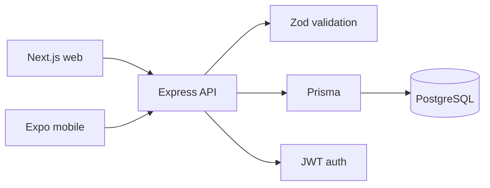

# Split

[](https://github.com/mjumair7/SPLIT/actions/workflows/ci.yml)

Split is a workout tracker I built around a problem I kept running into at the gym: a routine is easy to write down, but much harder to connect to consistent session logs and useful progress data.

The project has a web dashboard, a small Expo mobile client, and one Express API backed by PostgreSQL. My main focus was the data model—keeping planned workouts separate from completed sessions and making record updates part of the same transaction as the workout log.

## Current status

This is a portfolio-scale build, not a hosted fitness product. The core flows are implemented:

- register and sign in;
- create multi-day workout splits;
- assign exercises and rep targets to each day;
- log performed sets;
- track maximum weight and estimated one-rep max;
- view recent sessions and progress data from web or mobile clients.

The repository now has unit coverage for the shared training calculations. API integration tests and refresh-token support are still on the list; they are not presented as finished.

## Architecture



```text
apps/api/       Express, Prisma, validation, analytics
apps/web/       Next.js dashboard
apps/mobile/    Expo client for quick logging
docs/           manual API examples
```

## Why the schema is split this way

Planning and history are different things. A `WorkoutSplit` describes what I intend to do; a `WorkoutSession` records what actually happened. Keeping them separate means editing a routine later does not rewrite old training history.

Personal records are cached by user, exercise, and metric. When a session is logged, the session, its sets, and any record updates are written in one database transaction. If one write fails, the entire operation rolls back.

The API also checks ownership, exercise membership, duplicate exercises, and sequential set numbering before committing a session.

## Run locally

Requirements: Node.js 22, Docker, and npm.

```sh
docker compose up -d

cp apps/api/.env.example apps/api/.env
cp apps/web/.env.example apps/web/.env.local
cp apps/mobile/.env.example apps/mobile/.env

npm install
npm --workspace apps/api run db:generate
npm --workspace apps/api run db:migrate
npm --workspace apps/api run db:seed
```

Set the values described in each copied environment file, then start whichever clients you need:

```sh
npm run dev:api       # http://localhost:4000
npm run dev:web       # http://localhost:3000
npm run dev:mobile    # Expo development server
```

## Tests and checks

```sh
npm test
npm run build
```

GitHub Actions runs both commands for pushes and pull requests.

## API surface

Public:

- `POST /api/auth/register`
- `POST /api/auth/login`
- `GET /api/health`

Authenticated:

- `GET /api/me`
- `GET /api/exercises`
- `POST /api/splits`
- `GET /api/splits`
- `GET /api/splits/:splitId`
- `DELETE /api/splits/:splitId`
- `POST /api/workouts/sessions`
- `GET /api/workouts/sessions`
- `GET /api/analytics/summary`
- `GET /api/analytics/exercise/:exerciseId/progress`

The route handlers in `apps/api/src/` are the source of truth for request and response shapes.

## Things I would improve next

1. Add database-backed API integration tests.
2. Use short-lived access tokens with refresh-token rotation.
3. Add pagination to long session histories.
4. Share generated API types between the web and mobile clients.
5. Make kilograms/pounds a user preference instead of a fixed assumption.

The project taught me more about relational modelling and consistency than about drawing charts—which was the point.
