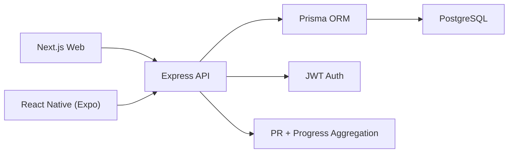

# Split App Interview Guide

This is your full talking script for interviews. Use it as both an architecture walkthrough and a defense document.

## 1) 30-Second Pitch
"I built Split, a full-stack gym app where users design workout splits, log session sets, and track personal records over time. I used a Node/Express API with Prisma/PostgreSQL for strong data integrity, Next.js + Tailwind + Recharts for the web dashboard, and an Expo React Native client for mobile quick logging. The backend enforces strict validation, ownership, and consistency checks, and personal records are updated transactionally whenever sessions are logged."

## 2) Project Story (How You Started)

### Problem framing
- Users track workouts in notes apps and spreadsheets, which creates inconsistent logs and no reliable progression history.
- Most simple gym apps let users log data but do not enforce program structure or consistent set tracking.

### Product goals
- Let users define structured split programs (days, focus, target sets/reps).
- Make logging fast enough to use in the gym.
- Automatically compute and store personal records.
- Give visual progression feedback over time.

### Non-functional goals
- Keep schema normalized and query-friendly.
- Enforce server-side validation (never trust client forms).
- Keep API contracts simple enough for both web and mobile clients.

## 3) SWE Lifecycle Walkthrough

### 1. Requirements
- Functional: auth, split builder, workout logging, analytics.
- Validation: required fields, range checks, unique constraints, ownership checks.
- Reporting: track max weight + estimated 1RM progression.

### 2. Design
- Chose monorepo to share domain model understanding across clients.
- Chose REST for predictable mobile/web consumption.
- Designed relational schema around program planning and execution logs.

### 3. Implementation
- Backend first: schema + API contracts + validation.
- Frontend second: workflows mapped exactly to API boundaries.
- Mobile third: quick logging client on shared auth and endpoints.

### 4. Verification
- Manual endpoint checks and UI-path checks (register -> create split -> log session -> verify chart/PR).
- DB-level uniqueness and referential constraints for integrity.

### 5. Iteration
- Added template load for split-day workout logging.
- Added transactional PR updates with session writes.
- Added analytics summary endpoint for dashboard KPIs.

## 4) Architecture (High-Level)

### Clients
- Web dashboard (Next.js): full experience for planning and analytics.
- Mobile app (Expo RN): quick access and in-gym logging.

### API
- Express routes grouped by domain:
  - `auth`
  - `exercises`
  - `splits`
  - `workouts`
  - `analytics`

### Data layer
- Prisma client for typed DB access.
- PostgreSQL as source of truth.

### Auth
- JWT bearer tokens.
- Auth middleware injects user identity into request context.

## 5) Data Model Defense (Why This Schema)

### Core entities
- `User`: account owner.
- `Exercise`: canonical exercise catalog.
- `WorkoutSplit`: top-level user program (e.g., Push Pull Legs).
- `SplitDay`: specific day + focus in a split.
- `SplitDayExercise`: per-day exercise prescriptions.
- `WorkoutSession`: performed training instance.
- `WorkoutSet`: granular logged set entries.
- `PersonalRecord`: best metric per user/exercise/metric.

### Why normalized this way
- Program definitions (`Split*`) are separate from execution logs (`Workout*`) to preserve history even if program changes later.
- `PersonalRecord` is a cache of best-known values to avoid expensive recalculation on every dashboard request.
- Composite uniqueness on `PersonalRecord(userId, exerciseId, metric)` guarantees one current PR row per metric.

### Constraints that matter in interviews
- `SplitDay` unique by `(splitId, dayOfWeek)` prevents duplicate weekdays in one split.
- `WorkoutSet` unique by `(sessionId, exerciseId, setNumber)` prevents accidental duplicate set inserts.
- Foreign keys + cascade behavior prevent orphan records.

## 6) API Design (What Each Domain Does)

### Auth
- `POST /auth/register`: create user + hash password + return token.
- `POST /auth/login`: credential check + return token.

### Splits
- `POST /splits`: create split + days + day exercises.
- `GET /splits`: list all user splits.
- `GET /splits/:id`: detail view.
- `DELETE /splits/:id`: remove split.

### Workouts
- `POST /workouts/sessions`: create session + set entries + update PRs in one transaction.
- `GET /workouts/sessions`: recent session history.

### Analytics
- `GET /analytics/summary`: monthly KPI tiles.
- `GET /analytics/exercise/:id/progress`: date series for charting.

## 7) Validation and Consistency Strategy

### Input validation
- All create/read queries parsed with Zod schemas.
- Numeric range checks for reps, set counts, RPE, weights.

### Consistency checks
- Exercise IDs must exist before split/session writes.
- Session exercises must be unique in payload.
- Set numbers must be sequential from 1.
- If logging under a split day, logged exercises must belong to that split day.

### Ownership checks
- Split and split-day lookups are always filtered by current authenticated user.

## 8) Transaction Logic (Critical Interview Section)

### Why transaction is required
A session log operation writes multiple tables:
- `WorkoutSession`
- `WorkoutSet`
- `PersonalRecord` updates

If one step fails and others commit, data becomes inconsistent. So this is wrapped in a single DB transaction.

### PR update algorithm
For each exercise in the submitted session:
1. compute `bestWeight` from set payload.
2. compute `bestEstimatedOneRepMax` with Epley formula `weight * (1 + reps/30)`.
3. compare with existing PR row for each metric.
4. update PR only if new value is higher.

This keeps PR updates idempotent and monotonic.

## 9) Frontend Design Decisions

### Web (Next.js)
- Single dashboard page with focused task modules:
  - auth panel
  - split builder
  - session logger
  - KPI summary cards
  - progress chart
  - recent history table
- Recharts chosen for quick time-series rendering with minimal boilerplate.
- Tailwind utility classes to keep UI iteration fast.

### Mobile (Expo)
- Lightweight auth + quick log UX for gym context.
- Reads same API contracts as web, reducing backend complexity.

## 10) Security Talking Points
- Passwords hashed with bcrypt.
- JWT required for protected routes.
- Server-side validation ensures clients cannot bypass constraints.
- CORS and helmet middleware baseline hardening.

## 11) Performance and Scaling Talking Points

### Current scale
- Suitable for early-stage usage and portfolio demo scale.

### Scale improvements you can propose
- Add Redis caching for analytics endpoints.
- Move PR calculation to background jobs for very large session payloads.
- Add pagination + cursor-based endpoints for long session history.
- Add DB indexes tuned to top query patterns (already started for user/date lookups).
- Add read replicas for analytics-heavy traffic.

## 12) Testing Strategy You Should Describe
- Unit tests for validation and PR calculation functions.
- Integration tests for auth and session transaction endpoint.
- Contract tests to lock response shapes used by both web and mobile.
- End-to-end flow test: register -> create split -> log workout -> verify analytics.

## 13) Tradeoffs (Strong Interview Answers)
- REST vs GraphQL: REST kept scope focused and easier for mobile/web dual client.
- Precomputed PR table vs on-demand aggregate: chose precomputed for fast reads.
- Monorepo vs multi-repo: monorepo improved development speed and consistency.
- Simple JWT session model vs refresh token flow: JWT-only for MVP simplicity; refresh rotation planned for production hardening.

## 14) "Grill Me" Questions and Answers

### Q: Why separate split planning and session logging tables?
A: Planning is a template; logging is historical execution. If user edits a split, historical sessions must remain unchanged.

### Q: Where do you enforce data integrity?
A: Three layers: request validation (Zod), application checks (ownership/membership), and DB constraints (unique keys + FKs).

### Q: What happens if PR update fails after session insert?
A: Session and PR updates run in one transaction, so the whole operation rolls back.

### Q: How do you avoid duplicate sets?
A: API requires sequential numbering and DB has unique `(sessionId, exerciseId, setNumber)`.

### Q: Why store estimated 1RM?
A: It provides a normalized strength metric across rep ranges; max weight alone misses progression at different rep counts.

### Q: How would you handle multiple exercise catalogs per gym or locale?
A: Add organization-level exercise tables or exercise alias mapping while preserving canonical IDs for analytics consistency.

### Q: How would you add social features?
A: Add follower relationships + shareable session feed, but keep core training data private by default with explicit sharing controls.

### Q: How would you productionize auth?
A: Add refresh token rotation, short-lived access tokens, token revocation list, and email verification.

### Q: Why not compute analytics fully in SQL group-by queries?
A: You can for large scale; current JS aggregation keeps logic readable and fast enough for MVP data sizes.

### Q: How do web and mobile stay aligned?
A: They consume the same API endpoints and payload contracts, with typed client wrappers per app.

## 15) Demo Script (What to Say While Showing Product)
1. Register/login and explain JWT flow.
2. Create a split with days and target prescriptions.
3. Log a workout session with set-level details.
4. Show recent session timeline.
5. Show progression chart and PR stats.
6. Explain transaction + consistency checks that guarantee trustworthy data.

## 16) Weaknesses You Can Admit (and Improve)
- No formal automated test suite yet.
- No refresh token/session revocation yet.
- Limited pagination/filtering in current API.
- Mobile app prioritizes quick logging over advanced charts.

These are acceptable if you pair each with a concrete roadmap item.
